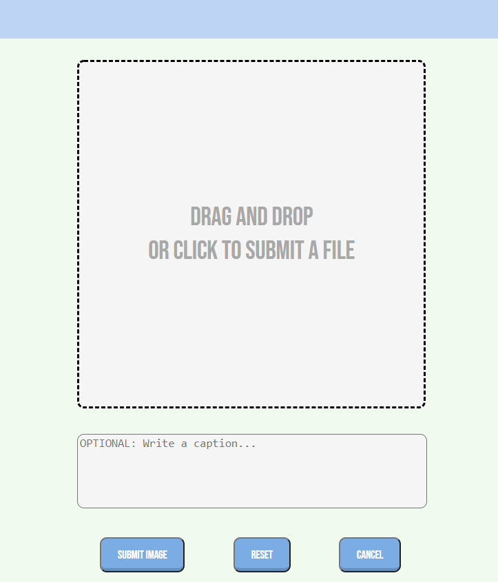

<p align='center'>
  
</p>

# PuppiGram

PuppiGram is a clone of instagram. Its focus is users sharing photos of their beloved pets, and  other pet photos they like. At this time it only allows sharing photos and commenting. Likes, profile page, and direct messaging is to come in the near future.


PuppiGram stores all photos on an aws photo bucket. This allows users to not only be restricted to posting photo links. Users can directly submit a photo from their local device library.

* View the <a href='https://puppigram1.herokuapp.com/'>puppigram</a> App Live

* Reference to puppiGram <a href='https://github.com/steffano2021/puppiGram/wiki'>Wiki Docs</a>

# Frontend Overview

Created a drop-in box so users can drop photos directly to the website and post it.

Post a new image


# Backend Overview

Using flask, created multiple back end with a forms serving as error handlers. when editing an image, if the caption was only edited, then an PUT method is executed. If the image and caption was changed, then a PATCH method is executed instead. The PUT method did not interact with aws unlike the PATCH method.

Part of code is shown below:

```python
    elif request.method == 'PUT':  # not submitting to aws
        form = ImageEditForm()
        form['csrf_token'].data = request.cookies['csrf_token']
        if form.validate_on_submit():
            data = form.data
            # image.image = data['image']
            image.caption = data['caption']
            db.session.commit()
            return image.to_dict()
        else:
            return {'errors':form.errors}, 500

    elif request.method == 'PATCH': # submits to aws
        form = ImageCreateForm()
        form['csrf_token'].data = request.cookies['csrf_token']
        if form.validate_on_submit():
            data = form.data
            file = data['image']
            file_url = upload_file_to_s3(file, Config.S3_BUCKET)
            image.image = file_url,
            image.caption = data['caption']
            db.session.commit()
            return image.to_dict()
        else:
            return {'errors':form.errors}, 500
```


## Technologies
* <a href="https://developer.mozilla.org/en-US/docs/Web/JavaScript"></a>
* <a href="https://www.postgresql.org/"></a>
* <a href="https://nodejs.org/"></a>
* <a href="https://reactjs.org/"></a>
* <a href="https://redux.js.org/"></a>
* <a href="https://developer.mozilla.org/en-US/docs/Web/CSS"></a>
* <a href="https://www.python.org/"></a>
* <a href="https://flask.palletsprojects.com/"></a>
* <a href="https://aws.amazon.com/"></a>

* <a href="https://aws.amazon.com/"></a>


# Installing to your local computer
## Getting started

1. Clone this repository (only this branch)

   ```bash
   git clone https://github.com/steffano2021/puppiGram.git
   ```

2. Install dependencies

      ```bash
      pipenv install --dev -r dev-requirements.txt && pipenv install -r requirements.txt
      ```

3. Create a **.env** file based on the example with proper settings for your
   development environment
4. Setup your PostgreSQL user, password and database and make sure it matches your **.env** file

5. Get into your pipenv, migrate your database, seed your database, and run your flask app

   ```bash
   pipenv shell
   ```

   ```bash
   flask db upgrade
   ```

   ```bash
   flask seed all
   ```

   ```bash
   flask run
   ```

6. To run the React App in development, checkout the [README](./react-app/README.md) inside the `react-app` directory.

***
*IMPORTANT!*
   If you add any python dependencies to your pipfiles, you'll need to regenerate your requirements.txt before deployment.
   You can do this by running:

   ```bash
   pipenv lock -r > requirements.txt
   ```

*ALSO IMPORTANT!*
   psycopg2-binary MUST remain a dev dependency because you can't install it on apline-linux.
   There is a layer in the Dockerfile that will install psycopg2 (not binary) for us.
***

## Deploy to Heroku

1. Before you deploy, don't forget to run the following command in order to
ensure that your production environment has all of your up-to-date
dependencies. You only have to run this command when you have installed new
Python packages since your last deployment, but if you aren't sure, it won't
hurt to run it again.

   ```bash
   pipenv lock -r > requirements.txt
   ```

2. Create a new project on Heroku
3. Under Resources click "Find more add-ons" and add the add on called "Heroku Postgres"
4. Install the [Heroku CLI](https://devcenter.heroku.com/articles/heroku-command-line)
5. Run

   ```bash
   heroku login
   ```

6. Login to the heroku container registry

   ```bash
   heroku container:login
   ```

7. Update the `REACT_APP_BASE_URL` variable in the Dockerfile.
   This should be the full URL of your Heroku app: i.e. "https://flask-react-aa.herokuapp.com"
8. Push your docker container to heroku from the root directory of your project.
   (If you are using an M1 mac, follow [these steps below](#for-m1-mac-users) instead, then continue on to step 9.)
   This will build the Dockerfile and push the image to your heroku container registry.

   ```bash
   heroku container:push web -a {NAME_OF_HEROKU_APP}
   ```

9. Release your docker container to heroku

      ```bash
      heroku container:release web -a {NAME_OF_HEROKU_APP}
      ```

10. set up your database

      ```bash
      heroku run -a {NAME_OF_HEROKU_APP} flask db upgrade
      heroku run -a {NAME_OF_HEROKU_APP} flask seed all
      ```

11. Under Settings find "Config Vars" and add any additional/secret .env
variables.

12. profit

### For M1 Mac users

(Replaces **Step 8**)

1. Build image with linux platform for heroku servers. Replace
{NAME_OF_HEROKU_APP} with your own tag:

   ```bash=
   docker buildx build --platform linux/amd64 -t {NAME_OF_HEROKU_APP} .
   ```

2. Tag your app with the url for your apps registry. Make sure to use the name
of your Heroku app in the url and tag name:

   ```bash=2
   docker tag {NAME_OF_HEROKU_APP} registry.heroku.com/{NAME_OF_HEROKU_APP}/web
   ```

3. Use docker to push the image to the Heroku container registry:

   ```bash=3
   docker push registry.heroku.com/{NAME_OF_HEROKU_APP}/web
   ```

## Contact

### Steffano Vidal-Espinoza
<a href="https://www.linkedin.com/in/steffanovidal/"></a>
<a href="https://angel.co"></a>
<a href="https://github.com/steffano2021"></a>
